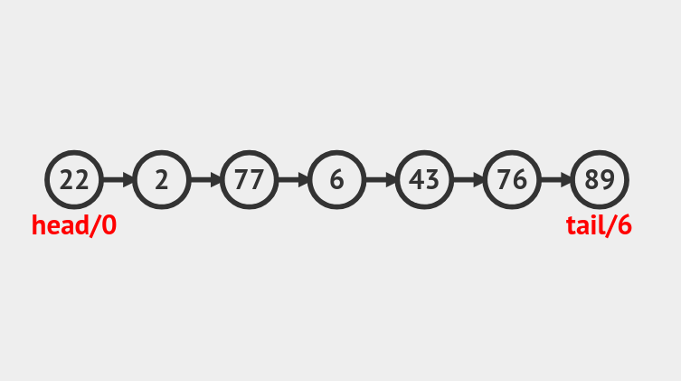
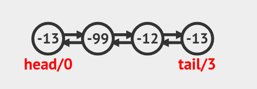
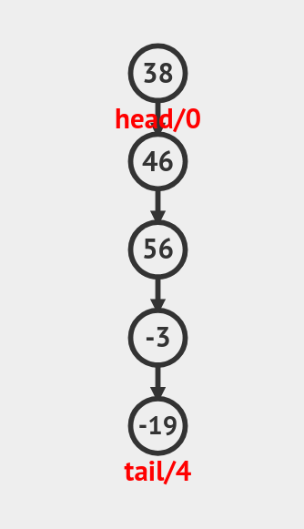
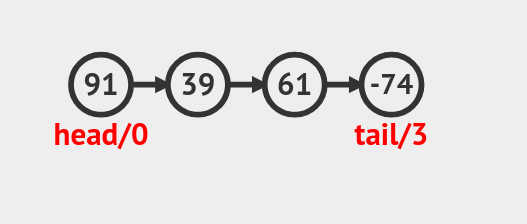
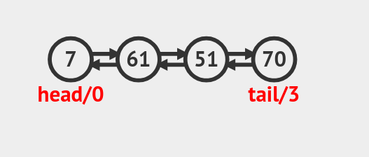
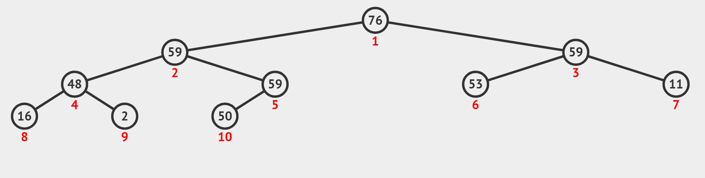
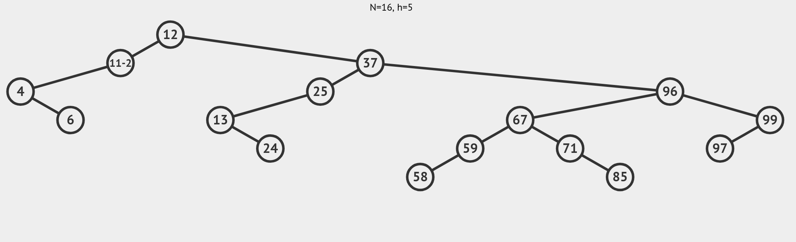
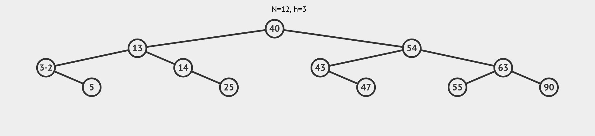

# Data Structures Collection

---

## О проекте

Этот репозиторий содержит реализацию популярных структур данных на языке Java с использованием универсальных дженериков.

Проект ориентирован на образовательные цели и демонстрирует базовые и продвинутые структуры данных, такие как списки, стеки, очереди, деревья и хэш-таблицы.

---

## Реализованные структуры данных

---

### 1. Singly Linked List (Односвязный список)

**Описание:**  
Односвязный список с базовыми операциями добавления, удаления и поиска элементов.

[**Визуализация методов**](https://visualgo.net/en/list)

  

**Код реализации:**  
[**Java**](src/Java/Structures/List/SinglyLinkedList.java)

---

### 2. Doubly Linked List (Двусвязный список)

**Описание:**  
Двусвязный список с базовыми операциями добавления, удаления и поиска элементов.

[**Визуализация методов**](https://visualgo.net/en/list)

  

**Код реализации:**  
[**Java**](src/Java/Structures/List/DoublyLinkedList.java)

---

### 3. Stack (Стек)

**Описание:**  
Структура данных LIFO (Last In First Out) с операциями push, pop и peek.

[**Визуализация методов**](https://visualgo.net/en/list)

  

**Код реализации:**  
[**Java**](src/Java/Structures/Stack/LinkedStack.java)

---

### 4. Queue (Очередь)

**Описание:**  
Структура данных FIFO (First In First Out) с операциями add, remove и peek.

[**Визуализация методов**](https://visualgo.net/en/list)

  

**Код реализации:**  
[**Java**](src/Java/Structures/Queue/LinkedQueue.java)

---

### 5. Deque (Двунаправленная очередь)

**Описание:**  
Структура данных, позволяющая вставлять и удалять элементы с обоих концов.

[**Визуализация методов**](https://visualgo.net/en/list)

  

**Код реализации:**  
[**Java**](src/Java/Structures/Queue/LinkedDeque.java)

---

### 6. Binary Tree (Бинарное дерево)

**Описание:**  
Простейшее бинарное дерево с поддержкой обходов и базовых операций.

[**Визуализация методов**](https://visualgo.net/en/bst)

  

**Код реализации:**  
[**Java**](src/Java/Structures/Tree/BinaryTree.java)

---

### 7. Binary Search Tree (Двоичное дерево поиска)

**Описание:**  
Бинарное дерево, в котором для каждого узла все значения в левом поддереве меньше, а в правом — больше.

[**Визуализация методов**](https://visualgo.net/en/bst)

  

**Код реализации:**  
[**Java**](src/Java/Structures/Tree/BinarySearchTree.java)

---

### 8. AVL Tree (Сбалансированное двоичное дерево поиска)

**Описание:**  
Самобалансирующееся дерево с гарантированной высотой O(log n) для всех операций.

[**Визуализация методов**](https://visualgo.net/en/bst)

  

**Код реализации:**  
[**Java**](src/Java/Structures/Tree/AVLTree.java)

---

### 9. Red-Black Tree (Красно-чёрное дерево)

**Описание:**  
Самобалансирующееся двоичное дерево с цветными узлами для балансировки.

  

**Код реализации:**  
[**Java**](src/Java/Structures/Tree/RedBlackTree.java)

---

### 10. HashMap (Хэш-таблица на основе связанных списков)

**Описание:**  
Ассоциативный массив с разрешением коллизий методом цепочек (linked lists).

  

**Код реализации:**  
[**Java**](src/Java/Structures/Map/HashMap.java)

---

## Таблица
| Структура данных     | Краткое описание                       | Временная сложность (поиск) | Временная сложность (вставка/удаление) |
|----------------------|----------------------------------------|-----------------------------|-----------------------------------------|
| Singly Linked List   | Последовательный односвязный список    | O(n)                        | O(1) (в начале), O(n) (в конце)         |
| Doubly Linked List   | Двусвязный список                      | O(n)                        | O(1) (в начале/конце)                   |
| Stack                | Стек LIFO                              | O(1)                        | O(1)                                    |
| Queue                | Очередь FIFO                           | O(1)                        | O(1)                                    |
| Deque                | Двунаправленная очередь                | O(1)                        | O(1)                                    |
| Binary Tree          | Бинарное дерево                        | O(n)                        | O(n)                                    |
| Binary Search Tree   | Двоичное дерево поиска                 | O(log n) среднее            | O(log n) среднее                        |
| AVL Tree             | Самобалансированное двоичное дерево    | O(log n)                    | O(log n)                                |
| Red-Black Tree       | Самобалансированное двоичное дерево    | O(log n)                    | O(log n)                                |
| HashMap              | Хэш-таблица с цепочками                | O(1) среднее                | O(1) среднее                            |

---

> Этот проект предназначен для обучения и демонстрации основных структур данных на Java.
